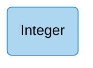
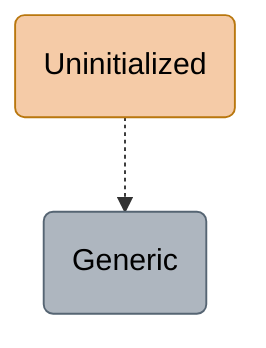
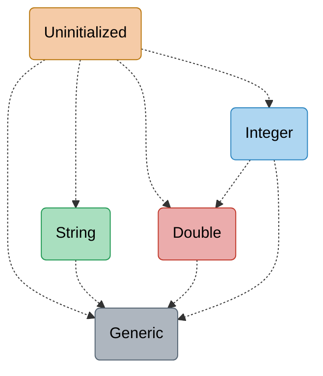

---
# try also 'default' to start simple
theme: default
# some information about your slides (markdown enabled)
title: One VM to Rule Them All
info: |
  Engagement section for the paper presentation "One VM to Rule Them
  ALl".
# https://sli.dev/features/drawing
drawings:
  persist: false
mdc: true
layout: two-cols-header
layoutClass: gap-x-4
fonts:
  sans: Arial
---

# An Example Truffle/Graal Pipeline

JavaScript as guest, Java as host.

::left::

```javascript {all}{lines:true}
function sum(n) {
  var sum = 0;
  for (var i = 1; i < n; i++) {
    sum += i;
  }
  return sum;
}
```

<v-click>

Remember that we're in JavaScript, so `sum` is generic and can have
any type.

What are the possible arguments, and what should the "intrepreter"
should do to execute the `+=` in each
case?

</v-click>

::right::

<v-clicks>

+ Is `sum` a string? -> string concatenation
+ Is it floating point? -> IEEE712 floating point addition
+ Is it an object? -> method lookup and potentially dynamic dispatch

</v-clicks>

<v-click>

Leads to inefficient code:

```java
@Generic
Object addGeneric(Frame f, Object a, Object b) {
    // Handling of String omitted for simplicity.
    Number aNum = Runtime.toNumber(f, a);
    Number bNum = Runtime.toNumber(f, b);
    return Double.valueOf(aNum.doubleValue() +
                          bNum.doubleValue());
}
```

</v-click>

---
layout: two-cols-header
layoutClass: gap-x-4
---

# Can we do better?

::left::

````md magic-move
```javascript {all}{lines:true}
function sum(n) {
  var sum = 0;
  for (var i = 1; i < n; i++) {
    sum += i;
  }
  return sum;
}
```
```javascript {all}{lines:true}
function sum(n) {
  var sum = 0;
  for (var i = 1; i < n; i++) {
    sum += i;
  }
  return sum;
}

sum(5)
```
TODO: add something more
````

<v-click at="+2">

When we run `sum(5)`, what datatype does the VM _actually see_ for
`sum` and `i` during the first few loop iterations?

</v-click>

<v-click>



Since our host is language
Java, we can run this using Java's `Integer` class!

</v-click>

::right::

<!-- <v-switch> -->
<!---->
<!-- <template #1> -->
<!---->
<!-- ```mermaid -->
<!-- graph TD -->
<!--     %% Node Definitions -->
<!--     U(Uninitialized) -->
<!--     G(Generic) -->
<!---->
<!--     style U fill:#f5cba7, stroke:#b9770e, color:#000 -->
<!--     style G fill:#aeb6bf, stroke:#566573, color:#000 -->
<!---->
<!--     U -.-> G -->
<!-- ``` -->
<!---->
<!-- </template> -->
<!---->
<!-- <template #2> -->
<!---->
<!-- ```mermaid -->
<!-- graph TD -->
<!--     %% Node Definitions -->
<!--     U(Uninitialized) -->
<!--     S(String) -->
<!--     D(Double) -->
<!--     I(Integer) -->
<!--     G(Generic) -->
<!---->
<!--     style U fill:#f5cba7, stroke:#b9770e, color:#000 -->
<!--     style S fill:#a9dfbf, stroke:#229954, color:#000 -->
<!--     style D fill:#ebacac, stroke:#c0392b, color:#000 -->
<!--     style I fill:#aed6f1, stroke:#2e86c1, color:#000 -->
<!--     style G fill:#aeb6bf, stroke:#566573, color:#000 -->
<!---->
<!--     U -.-> I -->
<!--     U -.-> S -->
<!--     U -.-> D -->
<!--     U -.-> G -->
<!---->
<!--     S -.-> G -->
<!---->
<!--     D -.-> G -->
<!---->
<!--     I -.-> D -->
<!--     I -.-> G -->
<!-- ``` -->
<!---->
<!-- </template> -->
<!---->
<!-- </v-switch> -->

<v-click at="2">


</v-click>

<!--
Now, are there ways to make it better?

In a JIT compiler, all the magic happens at runtime, so let's run this function
on a value, say `sum(5)`, and see how Truffle optimizations work.

First, the compiler turns the function `sum` into an AST tree. [Walk through the
corresponding positions]

Now let's consider an optimization opportunity, and let's just focus on `sum +=
1`. Sure, 
-->

---
layout: two-cols-header
layoutClass: gap-x-4
---

# Specialized AST nodes

::left::

<v-switch>

<template #0>



</template>

<template #1>



</template>

</v-switch>

::right::

````md magic-move {at:'+0'}
```java {all}{lines:true}
@Generic
Object addGeneric(Frame f, Object a, Object b) {
    // Handling of String omitted for simplicity.
    Number aNum = Runtime.toNumber(f, a);
    Number bNum = Runtime.toNumber(f, b);
    return Double.valueOf(aNum.doubleValue() +
                          bNum.doubleValue());
}
```
```java {all}{lines:true}
@Generic
Object addGeneric(Frame f, Object a, Object b) {
    // Handling of String omitted for simplicity.
    Number aNum = Runtime.toNumber(f, a);
    Number bNum = Runtime.toNumber(f, b);
    return Double.valueOf(aNum.doubleValue() +
                          bNum.doubleValue());
}

@Specialization(rewriteOn=ArithmeticException.class)
int addInt(int a, int b) {
    return Math.addExact(a, b);
}

@Specialization
double addDouble(double a, double b) {
    return a + b;
}
```
````

<!--
However, JavaScript is a dynamic language, and it might happen that we might
call `sum` with a slightly differen type. Heck, even if we're still calling
`sum` with integers, bad things can still happen 
-->

---
layout: two-cols-header
layoutClass: gap-x-4
---

# AST nodes rewriting

Orange: uninitialized, Blue: integers

::left::


::right::


---
layout: two-cols-header
layoutClass: gap-x-4
---

# Betraying the Pattern

Life changes, so do types.

````md magic-move
```javascript {all}{lines:true}
function sum(n) {
  var sum = 0;
  for (var i = 1; i < n; i++) {
    sum += i;
  }
  return sum;
}
```
```javascript {all}{lines:true}
function sum(n) {
  var sum = 0;
  for (var i = 1; i < n; i++) {
    sum += i;
  }
  return sum;
}

sum(5)
```
```javascript {all}{lines:true}
function sum(n) {
  var sum = 0;
  for (var i = 1; i < n; i++) {
    sum += i;
  }
  return sum;
}

sum(1000000)
```
````

<v-click>

If we're still using our specialized add that works on Java's 32-bit
`Integer` class, what would go wrong with this?

</v-click>

<v-click>

Hint: in JavaScript, ints must be represented precisely up to
$2^{53} - 1$, and
$1 + 2 + \cdots + 1000000 \approx 10^{40}$

</v-click>

<v-click>

`sum` will overflow.

Therefore, we should know when to run our optimized code or not when
the type changes. Ok, we can think of ways to do this, but how what
happens to our AST? It only knows how to do 32-bit integer additions now!

</v-click>

---
layout: two-cols-header
layoutClass: gap-x-4
---

# Generalization

::left::


::right::

<v-switch>

<template #1>


</template>

<template #2>


</template>

</v-switch>

<!--

Remember that we have this hierarchy of implementations of `add`, where the top
is most specialized and the bottom is most generalized. For maximum performance,
we want our code to be running the most specialized version.

We know that `sum` could be called on 32-bit integers, so we can only consider
implementations in the subtree of `Integer`.

Additionally, we also know that due to overflow, `sum` could also be called on
JavaScript doubles, so we can only consider implementations in the subtree of
`Double`.

What's the shallowest node in both subtrees, `Double`!
-->

---
layout: two-cols-header
layoutClass: gap-x-4
---

# How to know types mismatch

Side note: how do we know if our specialized code is incompatible with runtime
values,
either overflows or type mismatch?

::left::


::right::

```java {all|13-17}{lines:true}
class IAddNode extends BinaryNode {
    int executeInt(Frame f) throws UnexpectedResult {
        int a;
        try {
            a = left.executeInt(f);
        } catch (UnexpectedResult ex) { /* ... */ }

        int b;
        try {
            b = right.executeInt(f);
        } catch (UnexpectedResult ex) { /* ... */ }

        try {
            return Math.addExact(a, b);
        } catch (ArithmeticException ex) {
            throw rewrite(f, a, b);
        }
    }
}
```

---
layout: two-cols-header
layoutClass: gap-x-4
---

# Partial Compilation

<!-- Ideally we want machine code. Oh and no dynamic dispatch as well (i.e. as few -->
<!-- Java interpreter function calls as possible). -->

Once we run a tree enough times, we compile the logic of
the entire tree
down to machine code with aggressive inling
(including the logic for checking type mismatch).

::left::

<v-click>


</v-click>

::right::

<v-click>

```asm {all}{lines:true}
    mov     eax, 1        // JavaScript variable i
    mov     ebx, 0        // JavaScript variable sum
    jmp     L2

L1: mov     edx, ebx
    add     edx, eax    // Run the addition
    incl    eax
    safepoint           // Host-specific yield code
    mov     ebx, edx

L2: cmp     eax, esi
    jlt     L1
    box ebx (sum) into Integer object
    return boxed sum
```

</v-click>

<!--
By inlining, we mean that since I know that `sum`, `i`, and `n` are all ints, I
don't even need to traverse the AST tree and execute the nodes one by one. I
know exactly what types they should take, so I know exactly what implementations
of plus, less than, and all the other operations I should use.

Now we're in the same scenario as if we're writing a compiler. From our
perspective this function is completely typed, so we know how to compile it down
to optimized assembly.
-->

---
layout: two-cols-header
layoutClass: gap-x-4
---

# Incompatible optimized machine code

::left::

```javascript {all}{lines:true}
function sum(n) {
  var sum = 0;
  for (var i = 1; i < n; i++) {
    sum += i;
  }
  return sum;
}

sum(1000000)
```

<v-click>

Before we overflow, we would've run this entire `sum` function on 32-bit
integers enough times, that this entire function would've been compiled to
machine code.

</v-click>

<v-clicks>

- What should we do when compiling to 
  make sure we don't run compiled but incompatible code?
- What should we do when we realized our compiled code is incompatible?

</v-clicks>


::right::

<v-click>

````md magic-move
```asm {all}{lines:true}
    mov     eax, 1        // JavaScript variable i
    mov     ebx, 0        // JavaScript variable sum
    jmp     L2

L1: mov     edx, ebx
    add     edx, eax    // Run the addition
    incl    eax
    safepoint           // Host-specific yield code
    mov     ebx, edx

L2: cmp     eax, esi
    jlt     L1
    box ebx (sum) into Integer object
    return boxed sum
```
```asm {all}{lines:true}
    mov     eax, 1        // JavaScript variable i
    mov     ebx, 0        // JavaScript variable sum
    jmp     L2

L1: mov     edx, ebx
    add     edx, eax    // Writes the overflow flag
    jo      L3          // Jump if overflow
    incl    eax
    safepoint           // Host-specific yield code
    mov     ebx, edx

L2: cmp     eax, esi
    jlt     L1
    box ebx (sum) into Integer object
    return boxed sum
```
```asm {all}{lines:true}
    mov     eax, 1        // JavaScript variable i
    mov     ebx, 0        // JavaScript variable sum
    jmp     L2

L1: mov     edx, ebx
    add     edx, eax    // Writes the overflow flag
    jo      L3          // Jump if overflow
    incl    eax
    safepoint           // Host-specific yield code
    mov     ebx, edx

L2: cmp     eax, esi
    jlt     L1
    box ebx (sum) into Integer object
    return boxed sum

L3: call    deoptimize
```
````

</v-click>

::bottom::


---

# Back to Rewriting

Deoptimize and re-optimize.


<v-clicks>

+ Discard the optimized machine code.

+ Perform node rewriting since we need more generalized implementations.

+ Once we've ran the subtree of ndoes long enough, compile those nodes to
  optimized machine code again.

</v-clicks>

---
layout: two-cols-header
layoutClass: gap-x-4
---

# Intuition: why this is fast

Note a lattice-like pattern here:

::left::

<v-clicks>

- Everytime we rewrite the node, we always go one-level deeper because
  that's more generalized code.

- If a tree of nodes only runs a few types and that tree is run enough times on
  these types, then
  you'll be running on optimized machine code forever

- Having many levels of node rewriting, in tandem with
  partial compilation
  allows us to have some
  performance improvements even before hitting the stable points.

</v-clicks>

::right::


<!--
If I'm already at the integer level of generalization, there's no way I'm going
back to a more specialized code, I can only go down, and everytime I go down 1
more level.

Therefore, there is a constant number of rewrites I can always do, so there
isn't that much amount of rewrites.

Then, let's think long-term. Usually, even though JavaScript is dynamically
typed, our code is usually not so dynamic. That is, a variable is really ever
going to be 
one specific or
a small set of specific types.

Like `sum`. Sure, you can call it on a String, but any sane programmer would
ever only call it on numbers. So, after the point where we've compiled `sum` to
assembly
that uses the double implementation, you would never ever have to rewrite or
deoptimize
`sum` ever again.

Finally, the reason we have many levels is to take advantage of optimizations
while we have it. We don't have to wait for `sum` to encounter an overflow to
run optimized machine code.
In the `sum` case, we don't have to wait for tens of thousands of iterations
until `sum` becomes assembly; just after the 20-ith iteration, we're
already running assembly and we keep running assembly until an overflow comes.
So you tatste the benefit of optimized machine code temporarily even though this
might not be the final form.
-->
