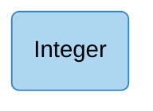
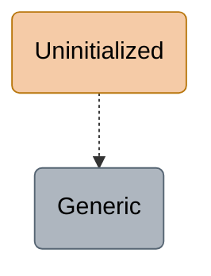
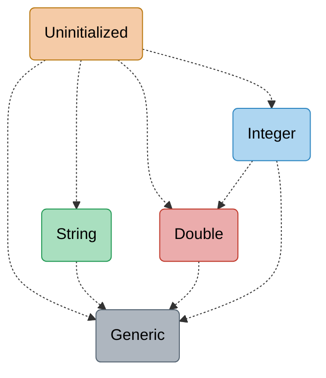
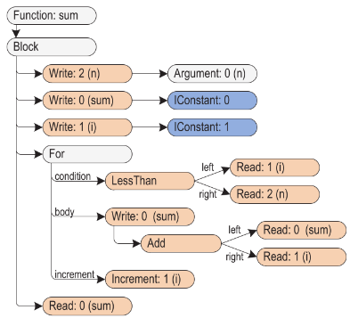
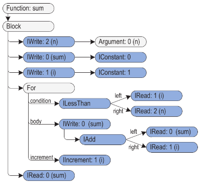
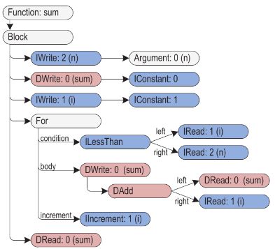
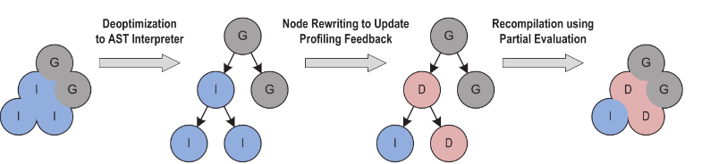

---
# try also 'default' to start simple
theme: default
# some information about your slides (markdown enabled)
title: One VM to Rule Them All
info: |
  Engagement section for the paper presentation "One VM to Rule Them
  ALl".
# https://sli.dev/features/drawing
drawings:
  persist: false
mdc: true
layout: two-cols-header
layoutClass: gap-x-4
fonts:
  sans: Arial
---

# An Example Truffle/Graal Pipeline

JavaScript as guest, Java as host.

::left::

```javascript {all}{lines:true}
function sum(n) {
  var sum = 0;
  for (var i = 1; i < n; i++) {
    sum += i;
  }
  return sum;
}
```

<v-click>

Remember that we're in JavaScript, so `sum` is generic and can have
any type.

What are the possible arguments, and what should the "intrepreter"
should do to execute the `+=` in each
case?

</v-click>

::right::

<v-click>

+ Is `sum` a string? -> string concatenation

</v-click>

<v-click>

+ Is it floating point? -> IEEE712 floating point addition

</v-click>

<v-click>

+ Is it an object? -> method lookup and potentially dynamic dispatch

</v-click>

---
layout: two-cols-header
layoutClass: gap-x-4
---

# Specialization

::left::

````md magic-move
```javascript {all}{lines:true}
function sum(n) {
  var sum = 0;
  for (var i = 1; i < n; i++) {
    sum += i;
  }
  return sum;
}
```
```javascript {all}{lines:true}
function sum(n) {
  var sum = 0;
  for (var i = 1; i < n; i++) {
    sum += i;
  }
  return sum;
}

sum(5)
```
````

<v-click>

When we run `sum(5)`, what datatype does the VM _actually see_ for
`sum` and `i` during the first few loop iterations?

</v-click>

<v-click>



Since our host is language
Java, we can run this using Java's `Integer` class!

</v-click>

::right::

<v-switch>

<template #1>



</template>

<template #2>



</template>

</v-switch>

---
layout: two-cols-header
layoutClass: gap-x-4
---

# Specialized AST nodes

Orange: uninitialized, Blue: integers

::left::



::right::



---
layout: two-cols-header
layoutClass: gap-x-4
---

# Betraying the Pattern

Life changes, so do types.

````md magic-move
```javascript {all}{lines:true}
function sum(n) {
  var sum = 0;
  for (var i = 1; i < n; i++) {
    sum += i;
  }
  return sum;
}
```
```javascript {all}{lines:true}
function sum(n) {
  var sum = 0;
  for (var i = 1; i < n; i++) {
    sum += i;
  }
  return sum;
}

sum(5)
```
```javascript {all}{lines:true}
function sum(n) {
  var sum = 0;
  for (var i = 1; i < n; i++) {
    sum += i;
  }
  return sum;
}

sum(1000000)
```
````

<v-click>

If we're still using our specialized add that works on Java's 32-bit
`Integer` class, what would go wrong with this?

</v-click>

<v-click>

Hint: in JavaScript, ints shall be represented precisely up to
$2^{53} - 1$, and
$1 + 2 + \cdots + 1000000 \approx 10^{11}$

</v-click>

<v-click>

`sum` will overflow.

Therefore, we should know when to run our optimized code or not when
the type changes. Ok, we can think of ways to do this, but how what
happens to our AST?

</v-click>

---
layout: two-cols-header
layoutClass: gap-x-4
---

# Generalization

::left::


::right::

<v-switch>

<template #1>


</template>

<template #2>



</template>

</v-switch>

---
layout: two-cols-header
layoutClass: gap-x-4
---

# Detection Code

Side note: how do we know if our specialized code is not suitable,
either overflows or type mismatch?

::left::


::right::

```java {all|13-17}{lines:true}
class IAddNode extends BinaryNode {
    int executeInt(Frame f) throws UnexpectedResult {
        int a;
        try {
            a = left.executeInt(f);
        } catch (UnexpectedResult ex) { /* ... */ }

        int b;
        try {
            b = right.executeInt(f);
        } catch (UnexpectedResult ex) { /* ... */ }

        try {
            return Math.addExact(a, b);
        } catch (ArithmeticException ex) {
            throw rewrite(f, a, b);
        }
    }
}
```

---
layout: two-cols-header
layoutClass: gap-x-4
---

# Partial Compilation

Ideally we want machine code.

Once we run a specialized node enough times, we compile the logic of
the node
down to machine code (including the logic for checking type mismatch)

::left::

<v-click>

```javascript {all}{lines:true}
function sum(n) {
  var sum = 0;
  for (var i = 1; i < n; i++) {
    sum += i;
  }
  return sum;
}

sum(1000000)
```

</v-click>

::right::

<v-click>

Before we overflow, we would've ran `sum += i` enough times that this
addition would've become machine code.

</v-click>

<v-click>

Now, when we overflow **while running optimized machine code**,
what are our options?

</v-click>

---

# Back to Rewriting

Deoptimize and re-optimize.



<v-clicks>

+ Discard the optimized machine code.

+ Perform node rewriting since our types have changed.

+ Once we've ran that set of nodes long enough, compile those nodes to
  optimized machine code.

</v-clicks>

---
layout: two-cols-header
layoutClass: gap-x-4
---

# Intuition: why this is fast enough even with rewrites

Note a lattice-like pattern here:

::left::

- Everytime we rewrite the node, we always go one-level deeper because
  that's more generalized code.

- If a node only runs a few types and that node is run enough times,
  you'll be running on optimized machine code.

- So you'll eventually hit a stable point where you'll always be
  running optimized machine code and will never have to de-optimize.

- Having many levels of node rewriting, in tandem with
  partial compilation
  allows us to have some
  performance improvements even before hitting the stable points.

::right::


